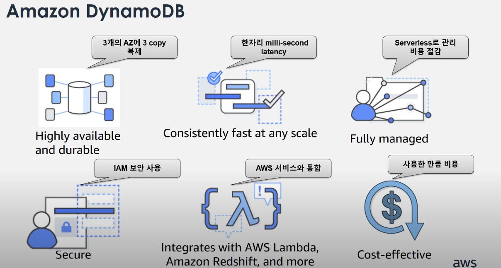
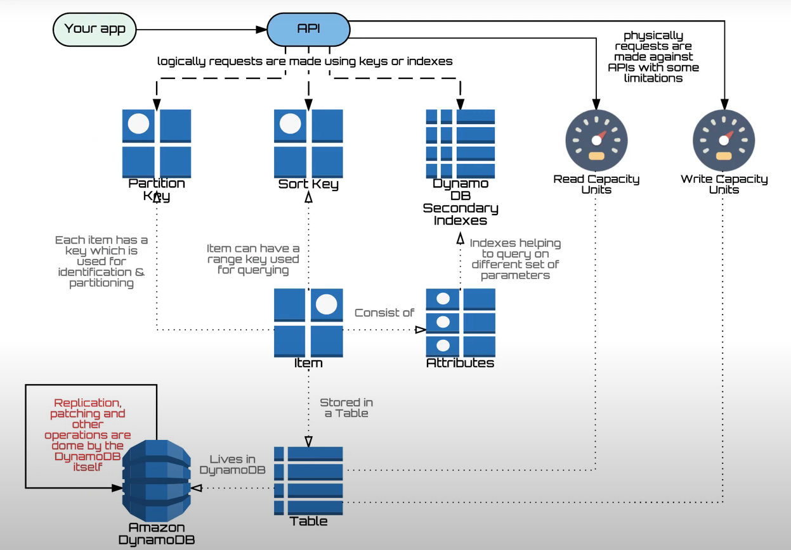
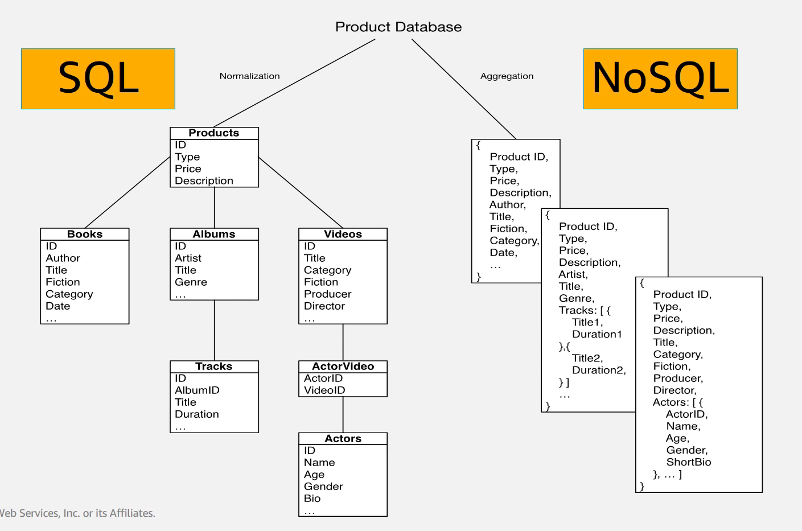

# Amazon Dynamodb란?
모든 규모에서 고성능 애플리케이션을 실행하도록 설계된 완전관리형의 서버리스 키-값 NoSQL 데이터베이스입니다.

- 성능: Low latency (낮은 지연시간)
- 용량: Almost infinite capacity (용량에 제한이 없음)
- 관리: No need to worry, Easy (관리가 쉽다)
- 확장: 완벽한(Seamless) scalability
- 고가용성: High Durability & Avaliablility
- 쉬운 Plannning: (via throughput parameter)

> 고가용성(HA: High Availability): 서버와 네트워크 또는 프로그램 등의 정보 시스템이 상당히 오랜 기간 동안 지속적으로 장애 없이 정상 운영이 가능한 성질

## Amazon DynamoDB

## How DynamoDB works?

## Data modeling: SQL vs NoSQL
- 일반적으로 RDBMS에서는 모델링을 할 때 데이터의 종속성과 중복성을 제거하는데 이 과정을 정규화과정이라고 합니다. 결과로 다수의 테이블이 만들어지며 입력된 데이터는 JOIN을 통해서 사용자가 원하는 데이터를 생성하게 됩니다.
- NoSQL은 RDBMS와는 다르게 정규화 과정이 없으며 access 패턴에 따라 item의 attrebute들이 달라질 수 있습니다. 또한 테이블로 분리했던 데이터들은 Document 형식으로 데이터를 처리할 수 있습니다.
