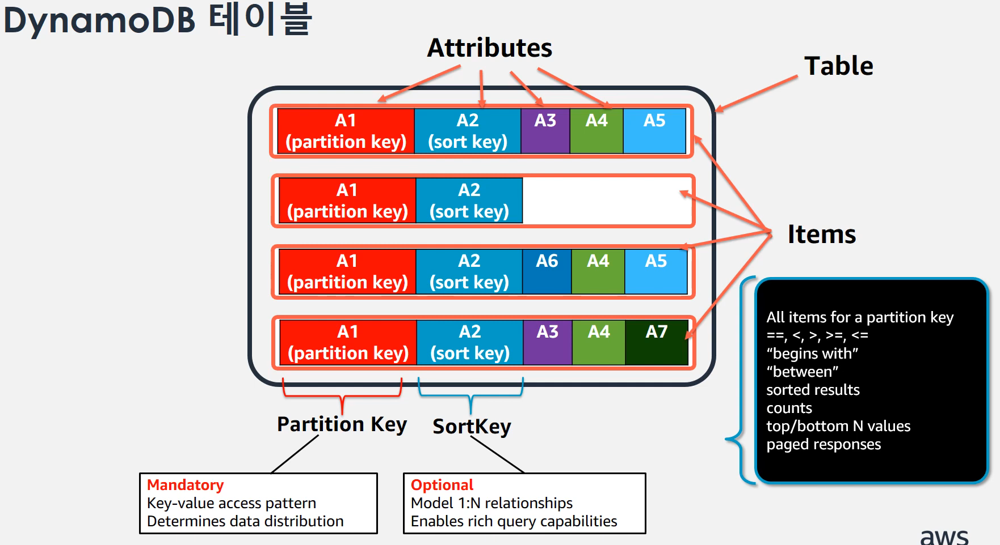

# Amazon DynamoDB의 핵심 구성 요소

## 테이블, Item 및 Attribute
- Table: 다른 데이터베이스 시스템과 마찬가지로 DynamoDB는 데이터를 테이블에 저장합니다. 테이블은 데이터의 집합입니다
- Item: 각 테이블에는 0개 이상의 항목이 있습니다. 항목은 모든 기타 항목 중에서 고유하게 식별할 수 있는 속성들의 집합입니다
- Attribute: 각 항목은 하나 이상의 속성으로 구성됩니다. 속성은 기본적인 데이터 요소로서 더 이상 나뉠 필요가 없는 것입니다. 여러 가지 면에서 다른 데이터베이스 시스템의 필드 또는 열과 유사합니다.

## [데이터 타입](https://docs.aws.amazon.com/ko_kr/amazondynamodb/latest/developerguide/ServiceQuotas.html#limits-data-types)
|Type|DynamoDB Type|
|----|----|
|String|String|
|Integer, Float|Number|
|Timestamp|Number or String|
|Blob|Binary|
|Boolean|Bool|
|Null|Null|
|List|List|
|Set|Set of String, Number, or Binary|
|Map|Map|

## 기본 키
테이블을 생성할 때는 테이블 이름 외에도 테이블의 기본 키를 지정해야 합니다. 기본 키는 테이블의 각 항목을 나타내는 고유 식별자입니다. 따라서 두 항목이 동일한 키를 가질 수는 없습니다.
Partition key와 Sort key의 조합이 PK의 역할을 합니다.

### Partition key
파티션 키로 알려진 하나의 속성으로 구성되는 단순 기본 키. DynamoDB는 내부 해시 함수에 대한 입력으로 파티션 키 값을 사용합니다. 해시 함수 출력에 따라 항목을 저장할 파티션(DynamoDB 내부의 물리적 스토리지)이 결정됩니다.

#### Partition key 선택기준
- 고유 값이 많은 속성
- 균일한 비율로 무작위로 요청되는 속성
- 예) 
    - Bad: 상태 값, 성별
    - Good: 고객 ID, 디바이스 ID

### Sort key
DynamoDB는 내부 해시 함수에 대한 입력으로 파티션 키 값을 사용합니다. 해시 함수 출력에 따라 항목을 저장할 파티션(DynamoDB 내부의 물리적 스토리지)이 결정됩니다. 파티션 키 값이 동일한 모든 항목은 정렬 키 값을 기준으로 정렬되어 함께 저장됩니다. 파티션 키와 정렬 키로 구성되어 있는 테이블에서는 여러 항목이 동일한 파티션 키 값을 가질 수 있습니다. 그러나 이러한 아이템의 정렬 키 값은 달라야 합니다.

#### Sort key 선택기준
- 1:n, m:n 관계 모델링
- 효율적/선택적 조회
- 범위 조회
- 예)
    - 고객별 주문 및 주문항목

### Partition key + Sort key 다양한 쿼리 가능
- --, <, >, >=, <=
- "bigins with"
- "between"
- "contains"
- "in"
- 정렬된 결과
- counts
- top/bottom N 개 값

## 인덱스(GSI와 LSI)
### Global Secondary Index
- Partition key을 가지고 데이터를 분포하고 Sort key 을 가지고 데이터를 정렬하는데 하지만 이 access pattern 말고 다른 pattern으로 데이터를 접근하고 싶을 때 사용한다.
- Partition key 기본 설정하고 Sort key는(Partition key + Sort key) 선택
- 인덱스 크기 제약 없음 (별도의 저장공간을 갖는다)
- 기존 테이블 대상 생성 및 삭제 가능
- Eventually consistent read만 가능
    - 테이블에 Item을 insert 하면 Async 방식으로 GSI에 해당되기 때문에 이 부분 꼭 주의하고 어플리케이션 레벨에서 핸들링 해야 한다.
- 테이블 당 20개까지 생성
- **별도의 읽기 & 쓰기 용량 할당**
    - GSI 에 충분한 쓰기 용량이 없다면, 테이블 쓰기에 병목 발생

### Local Secondary Index
- RDBMS 의 인덱스와 유사하다.
- 테이블과 동일한 Partition key를 유지한다.
- 인덱스는 10GB 단위 파티션 내 테이블 데이터와 함께 저장
- **기존 테이블 대상 생성 및 삭제 불가** (테이블을 생성할 때만 지정할 수 있다)
- 테이블의 할당된 RCU & WCU 소비
- Eventually consistent read 또는 Strongly Consistent Read 선택 가능
- 테이블 당 5개까지 생성

## 처리 용량 단위(Capacity Unit)
### 읽기 용량(Read Capacity Unit)
- 1 RCU는 초당 4KB 처리 단위로 측정됨
    - Eventually Consistent Read 는 읽기 2회 제공
    - Strongly Consistent Read 는 읽기 1회 제공
- RCU 계산 시 4KB  배수로 올림
- 예) item 크기가 7.5KB인 경우 8KB로 올림하며, 이 항목에 대해 초당 1회의 읽기를 수행시:
    - Eventually Consistent Read: 1 RCU 소진
    - Strongly Consistent Read: 2 RCU 소진

### 쓰기 용량(Write Capacity Unit)
- 1 WCU는 초당 1KB 처리 단위로 측정됨
- WCU 계산 시 1KB 배수로 올림
- 예) item 크기가 1.6KB인 항목 하나를 쓸 경우 2KB로 올림하며, 2WCU 소진