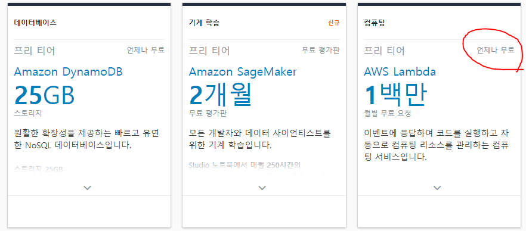

# AWS Lambda?
AWS Lambda는 서버를 프로비저닝 또는 관리하지 않고도 실제로 모든 유형의 애플리케이션 또는 백엔드 서비스에 대한 코드를 실행할 수 있는 이벤트 중심의 서버리스 컴퓨팅 서비스입니다. 200개가 넘는 AWS 서비스와 서비스형 소프트웨어(SaaS) 애플리케이션에서 Lambda를 트리거할 수 있으면 사용한 만큼만 지불하면 됩니다.

> 프로비저닝 : 사용자의 요구에 맞게 시스템 자원을 할당, 배치, 배포해 두었다가 필요 시 시스템을 즉시 사용할 수 있는 상태로 미리 준비해 두는 것을 말한다.

## AWS Lambda 장점?
- 서버 프로비저닝/관리 없이 코드 실행
- 사용량에 따른 지속적 규모 조정 (스케일링을 신경쓰지 않아도 됨)
- 밀리초 단위로 사용한 만큼만 요금 부과
    - [AWS Lambda 과금](https://aws.amazon.com/ko/lambda/pricing/)
    - 무기한 제공 프리티어 
- 높은 가용성 및 자동 복구(인프라 스트럭쳐에 대한 관리가 최소화 됨)

## 언어 및 실행 환경
AWS 람다에서는 2022년 05월 기준으로 
.NET 6(C#/PowerShell), .NET Core 3.1(C#/PowerShell), Go, Java, Node.js, Python, Ruby를 공식적으로 지원하고 있습니다. 공식 런타임이 없더라도 커스텀 런타임을 통해 지원하지 않는 언어를 사용할 수 있도록 확장할 수 있으며, 리눅스에서 실행가능한 임의의 바이너리를 포함해 실행하는 것도 가능합니다.

## 참고자료

[AWS Lambda의 Concurrent execution(동시 실행)에 대한 이해](https://medium.com/@jmmoon1974/lambda%EC%9D%98-concurrent-execution%EC%97%90-%EB%8C%80%ED%95%B4%EC%84%9C-%EC%9E%98-%EB%AA%BB-%EC%9D%B4%ED%95%B4%ED%95%98%EB%8A%94-%EB%B6%84%EB%93%A4%EC%9D%B4-%EC%9E%88%EC%96%B4-%EA%B8%80%EC%9D%84-%EC%9E%91%EC%84%B1%ED%95%B4-%EB%B4%85%EB%8B%88%EB%8B%A4-34913a7821f2)