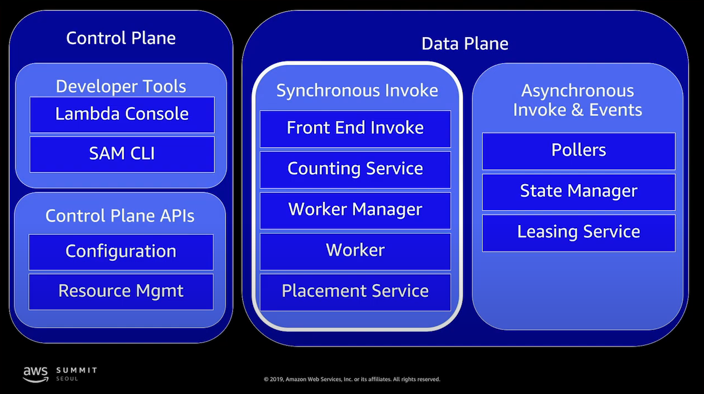
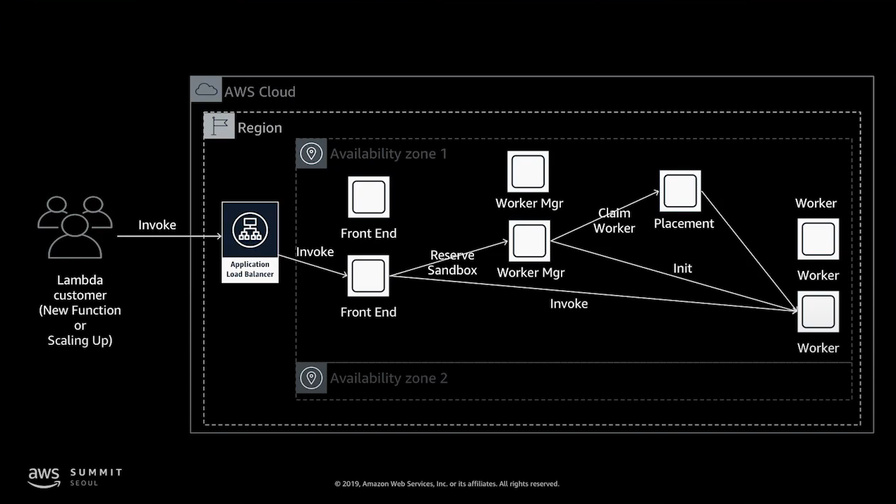
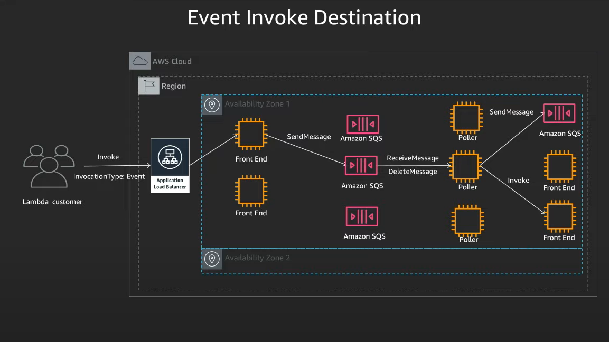

# AWS Lambda 내부동작

## 코드 레벨에서 본 AWS Lambda

### AWS Lambda 핸들러 함수
```python
def hander (event, context):
    ## business login here
    return response
```

#### AWS Lambda - event
- AWS Lambda가 invoke 될 때 다른 서비스에서 이벤트(혹은 데이터)를 전달받는다.
    - > [AWS Lambda Invoke](https://docs.aws.amazon.com/ko_kr/lambda/latest/dg/API_Invoke.html)
- 이 때, <code>어떤 서비스로부터 invoke 되었는지에 따라 event의 구조가 달라</code>진다.
- event는 꼭 JSON 형태가 아니더라도 list, string, number 등의 일반적인 타입들이라도 괜찮다.
- invoke 방식에는 크게 2가지 방식(Event / RequestResponse) 으로 나누어진다.
- **RequestResponse**(동기) 방식의 대표적인 예 : API Gateway -> Lambda
- RequestResponse방식으로 invoke 되더라도 데이터는 event 객체를 통해 Lambda함수에 전달된다.
<details> 
<summary> API gateway Event 예제 </summary>

```json 
{
      "resource": "/",
      "path": "/",
      "httpMethod": "GET",
      "requestContext": {
          "resourcePath": "/",
          "httpMethod": "GET",
          "path": "/Prod/",
          ...
      },
      "headers": {
          "accept": "text/html,application/xhtml+xml,application/xml;q=0.9,image/webp,image/apng,*/*;q=0.8,application/signed-exchange;v=b3;q=0.9",
          "accept-encoding": "gzip, deflate, br",
          "Host": "70ixmpl4fl.execute-api.us-east-2.amazonaws.com",
          "User-Agent": "Mozilla/5.0 (Windows NT 10.0; Win64; x64) AppleWebKit/537.36 (KHTML, like Gecko) Chrome/80.0.3987.132 Safari/537.36",
          "X-Amzn-Trace-Id": "Root=1-5e66d96f-7491f09xmpl79d18acf3d050",
          ...
      },
      "multiValueHeaders": {
          "accept": [
              "text/html,application/xhtml+xml,application/xml;q=0.9,image/webp,image/apng,*/*;q=0.8,application/signed-exchange;v=b3;q=0.9"
          ],
          "accept-encoding": [
              "gzip, deflate, br"
          ],
          ...
      },
      "queryStringParameters": null,
      "multiValueQueryStringParameters": null,
      "pathParameters": null,
      "stageVariables": null,
      "body": null,
      "isBase64Encoded": false
  }
```
</details>

#### AWS Lambda - context
- AWS Lambda의 Runtime 정보를 핸들러에게 제공하기 위해 사용한다.
    - 누가 실행시켰느냐에 관련이 없다.
- 로깅 등의 용도로 사용할 수 있는 메타데이터가 제공된다.
- 오랫동안 실행되는 AWS Lambda 함수의 경우, Context의 get_remaining_time_in_millis() - 타임아웃까지 얼마나 남았는지 확인하는 메소드.

#### Global Scope
- 핸들러 함수 바깥의 영역은 콜드 스타트시 (init) 에만 실행되는 부분.
    - 함수 종료 후에도 Worker 노드가 종료되지 않는 이상, 메모리에 남아있음.
- 초기화(initialization)에 관한 태스크를 이 영역에 배치해서 적절히 활용하면 AWS Lambda의 퍼포먼스 향상에 도움이 됨.
    - BUT, 흔히 활용하는 RDB 커넥션에 활용하는 경우 단점도 있으니 주의(특히 MSA 환경, 여러 함수에서 DB 커넥션을 사용하여 안 끊을 때 max connection 에 금방 도달 할 수 있다)
- [AWS Lambda의 동작 원리 - 전역변수가 유지될까](https://blog.hoseung.me/2022-02-27-lambda-global-variables/)
```python
## Global Scope

def hander (event, context):
    ## business login here
    return response
```

## 인프라 레벨에서 본 AWS Lambda

### [AWS Lambda invoke](https://docs.aws.amazon.com/ko_kr/lambda/latest/dg/API_Invoke.html)
- InvocationType은 세가지로 나누어진다. (invoke 시 어떤 방식으로 실행할 지 설정 가능)
- Event | RequestResponse | DryRun
- Event는 Asychronous 방식, RequestResponse는 Synchronous 방식, DryRun은 파라미터 및 권한을 검사해서 실행 가능한지에 대한 체크만을 수행
- Invocation Type이 Event이면 Lambda 함수가 성공했는지 여부를 알 수 없다.
- Event 방식으로 호출되는 경우
    - Amazone S3, Amazon SNS, EventBridge (CloudWatch Events) 등
- RequestResponse 방식으로 호출되는 경우
    - Amazon Kenesis, DynamoDB Streams, SQS, ALB, API Gateway

### Data Plane 


### Synchronous Invoke Data Plane
- Front End Invoke : 동기 비동기 호출을 모두 관장
- Countin Service : 사용자가 얼마나 많은 API 요청을 하는지 모니터링하고 제한기능 제공
- Worker Manager : 실제 Container의 상태를 관리하고 API 요청을 가용 가능한 Container 로 중계
- Worker : 고객 함수(코드)가 안전하게 실행되는 실제 Container 환경
- Placement Service : Worker에 Sandbox 구성을 자원 활용률이 높고, 고객 서비스 영향이 없도록 관리

### Synchronous Invoke
- 동기식 호출에서는 함수 응답에 대한 세부 정보(오류 포함)가 응답 본문과 헤더에 포함됩니다. 두 호출 유형에 대한 자세한 내용은 실행 로그 및 추적에서 찾을 수 있습니다.
- 오류가 발생하면 함수가 여러 번 호출될 수 있습니다. 재시도 동작은 오류 유형, 클라이언트, 이벤트 소스, 호출 유형에 따라 다릅니다. 예를 들어 함수를 비동기식으로 호출했는 데 오류를 반환한 경우 Lambda는 함수를 최대 두 번 더 실행합니다.

### Synchronous Invoke 간단한 아키텍쳐


### Asynchronous Invoke Data Plane
- Poller : queue 에 저장되어 있는 event를 꺼내와서 처리되는 과정을 관장한다.
- State Manager/Stream Tracker : Poller 를 스케일링 하거나 이벤트 리소스를 관리한다. 
- Leasing Service : 어떤 Poller 서비스가 어떤 이벤트를 담당할 것인지 할당한다.

### Asynchronous Invoke
- 비동기 호출의 경우 이벤트를 함수로 보내기 전에 Lambda가 이벤트를 대기열(람다 내부 SQS)에 추가합니다. 
- 대기열에 맞출 수 있는 함수의 용량이 충분하지 않으면 이벤트가 손실될 수 있습니다. 
    - 따라서 반드시 수행되어야 하는 태스크는 별도의 고객소유 SQS 를 통해 invoke 시켜야 합니다.
- 경우에 따라 오류가 발생하지 않더라도 함수가 동일한 이벤트를 여러 번 수신할 수 있습니다.
- 비동기 방식으로 호출된 Lambda 함수가 실패하는 경우, Dead Letter Queue 를 통해 실패 알림을 받을 수 있다.

### Asynchronous Invoke 간단한 아키텍쳐


### Firecracker
- [Firecracker](https://firecracker-microvm.github.io/)
- Firecracker는 AWS Lambda와 Fargate와 같은 서비스를 통해 자원 활용률과 고객 사용 환경을 개선하는 동시에 퍼블릭 클라우드 인프라에 필요한 보안 그리고 격리(isolation)을 제공하기 위해 AWS 개발자에 의해 구축이 되었습니다. Firecracker는 Rust라는 언어로 작성된 오픈 소스 VMM인 Chromium OS의 가상 시스템 모니터(crosvm)에서 시작되었습니다. 이후에 crosvm과 Firecracker는 다양한 고객 요구사항을 충족하기 위해 서로 다른 방식으로  개발되고 있습니다

### AWS Lambda에서 DB 접근 시 유의할 점
- 여러 가용 영역 내 Subnet 에 ENI 사용
    - 가용 영역 레벨의 이벤트 또는 IP 소모 문제를 피할 수 있음
- Lambda는 VPC 내 ENI 로 접근
    - 따라서 가용 IP에 따른 확장성의 제약을 고려 해야함
    - ENI 신규 구성은 시간이 소모됨
- Public host name DNS 쿼리를 피할수록 좋음
    - 비용과 시간 소모
- 기본적으로 VPC의 Lambda는 인터넷 접근이 불가능함
    - NAT Gateway (or NAT instance)를 추가하고 Routing Table 구성으로 사용이 가능함
- Container 당 하나의 connection 만 사용
- connection Pool Size = 1로 설정
- handler 밖에 Global secion 에 DB connect 객체를 생성 재활용
```javascript
const mysql = require('mysql')

const pool = mysql.createPool({
    host: {your host},
    user : {your username},
    password : {your password},
    database : {your database},
    port: 3306
});

exports.main = function main(req) {
    let query = ""
    return new Promise(function(reslove, reject){
        return resolve({
            statusCode : 200,
            body : "success"
        });
    })
}
```
### Concurrency 제한의 장점
- Labmbda의 동시 실행은 account와 function 레벨 모두 제한이 가능
- AWS Labmda는 호출 제한이 있을 경우 retry 수행 / 관리

### Concurrency 제한의 고려사항
- Account Level 제한
    - Account 내 모든 Lambda에 적용되어 DB 접근 함수 제한이 간단하지는 않다.
    - 여러 팀이 단일 Account 사용 시 관리
- Function Level 제한
    - 어떤 Lambda 함수가 DB 접근이 필요한지 확인
    - Peak 발생 하기 전에 알고 Application 레벨의 이해 필요
    - Lambda 워크로드가 다양할 경우, 다이나믹한 connection 할당이 어려움